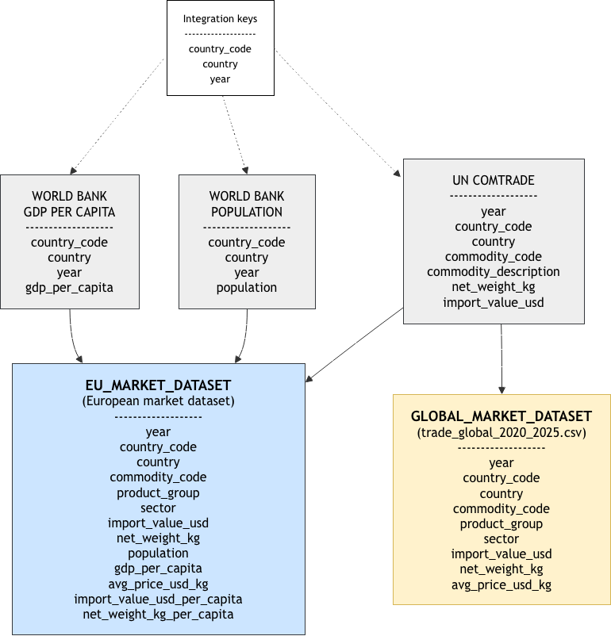
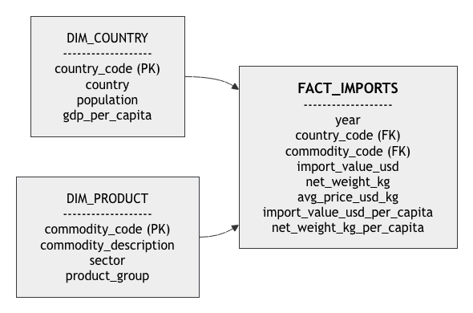

# Modelo de datos

## Introducción

El proyecto se desarrolla en dos niveles:

1. **Modelo actual**, utilizado en la versión presentada para el bootcamp.
2. **Modelo futuro**, diseñado para facilitar la ampliación del proyecto con nuevas fuentes de información.

---

# Modelo actual

El dashboard actual se construye a partir de un único dataset analítico generado mediante la integración de tres fuentes de datos.

## Fuentes utilizadas

### UN Comtrade

Información de comercio internacional utilizada para analizar las importaciones de café y cacao.

Variables principales:

- Año
- País importador
- Producto
- Peso neto importado
- Valor de importación

### World Bank Population

Información demográfica utilizada para contextualizar el volumen de importaciones.

Variable principal:

- Población total por país y año

### World Bank GDP per Capita

Información económica utilizada para enriquecer el análisis.

Variable principal:

- PIB per cápita por país y año

---

## Integración de datos

Las tres fuentes se integran mediante las siguientes claves comunes:

- `country_code`
- `country`
- `year`

Como resultado del proceso de limpieza, transformación y enriquecimiento se genera el dataset analítico:

`trade_enriched_complete_2020_2024.csv`

Este dataset contiene tanto las métricas originales de comercio internacional como los indicadores derivados utilizados posteriormente en el dashboard.

---

## Dataset global complementario

Además del dataset principal centrado en la Unión Europea, se genera un segundo dataset procesado:

`trade_global_2020_2025.csv`

Este dataset conserva todos los países disponibles en UN Comtrade y se utiliza como capa de benchmark internacional dentro del dashboard.

Características principales:

- 2.485 registros.
- 176 países.
- Cobertura global.
- Mismas categorías de producto utilizadas en el análisis europeo.

Variables principales:

- `year`
- `country_code`
- `country`
- `commodity_code`
- `product_group`
- `sector`
- `import_value_usd`
- `net_weight_kg`
- `avg_price_usd_kg`

Su objetivo es contextualizar el análisis de la Unión Europea frente al mercado mundial sin modificar el foco principal del proyecto.

--- 

**Nota:** El dataset global se construye exclusivamente a partir de UN Comtrade y se utiliza como referencia comparativa internacional. El dataset europeo incorpora además variables demográficas y económicas procedentes de World Bank.

---

## Diagrama del modelo actual

---

# Modelo futuro

Con el objetivo de ampliar el alcance del proyecto y facilitar su evolución hacia una plataforma de inteligencia de mercado para café y cacao, se propone una arquitectura dimensional basada en un modelo estrella (*Star Schema*).

Este enfoque permitiría incorporar nuevas fuentes de información sin modificar la estructura principal del modelo analítico.

Posibles ampliaciones:

- Consumo de café y cacao.
- Exportaciones.
- País de origen de las importaciones.
- Indicadores económicos adicionales.
- Segmentación demográfica.
- Datos de sostenibilidad.
- Indicadores de producción agrícola.

---

## Estructura propuesta

### DIM_COUNTRY

Contendría los atributos descriptivos de cada país.

Variables principales:

- country_code
- country
- population
- gdp_per_capita

### DIM_PRODUCT

Contendría la información descriptiva de los productos analizados.

Variables principales:

- commodity_code
- commodity_description
- sector
- product_group

### FACT_IMPORTS

Contendría las métricas de negocio y los indicadores calculados.

Variables principales:

- import_value_usd
- net_weight_kg
- avg_price_usd_kg
- import_value_usd_per_capita
- net_weight_kg_per_capita

---

## Diagrama del modelo futuro

---

## Beneficios del modelo futuro

- Mayor escalabilidad.
- Reducción de redundancia en los datos.
- Mejor rendimiento analítico.
- Compatibilidad con herramientas BI como Power BI.
- Facilidad para incorporar nuevas dimensiones y métricas.
- Separación clara entre datos maestros y métricas de negocio.
- Arquitectura alineada con buenas prácticas de Data Warehouse.